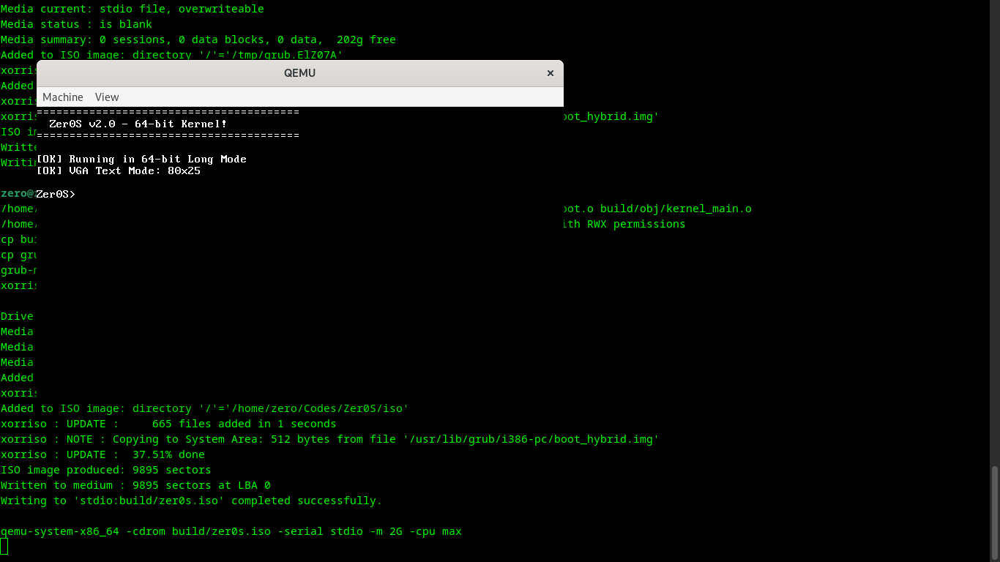
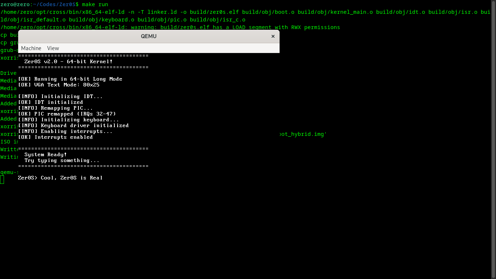

# 🚀 Zer0S - Sistema Operacional 64-bit do Zer0

[](https://github.com/Zer0G0ld/Zer0S/stargazers)
[](https://github.com/Zer0G0ld/Zer0S/network)
[](https://github.com/Zer0G0ld/Zer0S/issues)
[](https://github.com/Zer0G0ld/Zer0S/releases)


## 📸 Demonstração


*Primeiro boot bem-sucedido do Zer0S 64-bit*


*Shell interativo rodando comandos*

## ✨ Características

### Implementado ✅
- [x] Boot em **64-bit Long Mode**
- [x] **Cross-compiler** x86_64 configurado
- [x] **Paginação 4 níveis** (PML4/PDPT/PD/PT)
- [x] **IDT** com 256 entradas e handlers
- [x] **PIC remapeado** (IRQs 32-47)
- [x] **Driver de teclado PS/2** completo
- [x] **VGA Text Mode** (80x25, 16 cores)
- [x] **Shell interativo** com 8 comandos
- [x] Sistema de **build automatizado** (Makefile)

### Em desenvolvimento 🚧
- [ ] Gerenciador de memória (malloc/free)
- [ ] System calls (syscall/sysret)
- [ ] Timer (PIT/HPET)
- [ ] Multitarefa (scheduler)
- [ ] Sistema de arquivos simples
- [ ] Drivers de dispositivos
- [ ] Modo usuário (ring 3)

## 🎮 Comandos do Shell

| Comando | Descrição | Exemplo |
|---------|-----------|---------|
| `help` | Lista todos os comandos | `help` |
| `clear` | Limpa a tela | `clear` |
| `info` | Mostra informações do sistema | `info` |
| `echo` | Imprime o texto | `echo Hello World!` |
| `status` | Mostra status do sistema | `status` |
| `hex` | Converte número para hexadecimal | `hex 255` |
| `about` | Sobre o Zer0S | `about` |
| `reboot` | Reinicia o sistema | `reboot` |

## 🛠️ Requisitos

### Dependências (Debian/Ubuntu)
```bash
sudo apt update
sudo apt install -y build-essential bison flex libgmp3-dev libmpc-dev \
    libmpfr-dev texinfo nasm qemu-system-x86 xorriso mtools grub-pc-bin \
    gdb wget
```

### Para outros sistemas
- **NASM** - Montador para assembly
- **QEMU** - Emulador para testes
- **GRUB** - Bootloader
- **GCC** - Compilador (ou cross-compiler)

## 📥 Instalação

### Clonar o repositório
```bash
git clone https://github.com/Zer0G0ld/Zer0S.git
cd Zer0S
```

### Compilar
```bash
# Limpar builds anteriores
make clean

# Gerar ISO bootável
make iso

# Rodar no QEMU
make run
```

### Comandos Make disponíveis
```bash
make clean   # Remove arquivos compilados
make iso     # Cria a imagem ISO
make run     # Executa no QEMU
make debug   # Modo debug com GDB
```

## 🏗️ Estrutura do Projeto

```
Zer0S/
├── boot/                   # Bootloader
│   ├── multiboot/         # Configuração GRUB
│   └── uefi/              # (futuro) Boot UEFI
├── kernel/                 # Núcleo do sistema
│   ├── arch/x86_64/       # Código específico da arquitetura
│   │   ├── boot.asm       # Entry point (32-bit -> 64-bit)
│   │   ├── idt.c/h        # Tabela de descritores de interrupção
│   │   ├── isr.c/asm      # Rotinas de serviço de interrupção
│   │   ├── keyboard.c     # Driver de teclado PS/2
│   │   ├── pic.c          # Controlador de interrupção programável
│   │   ├── shell.c        # Shell interativo
│   │   └── ...
│   ├── core/              # Núcleo independente (futuro)
│   ├── hal/               # Camada de abstração de hardware
│   └── include/           # Headers do sistema
├── servers/               # Servidores userspace (futuro)
├── lib/                   # Bibliotecas (futuro)
├── user/                  # Programas de usuário (futuro)
├── tools/                 # Scripts de build
├── screenshots/           # Screenshots do sistema
├── Makefile              # Sistema de build
├── linker.ld             # Linker script
├── grub.cfg              # Configuração do GRUB
└── README.md             # Este arquivo
```

## 🔧 Desenvolvimento

### Compilação manual passo a passo
```bash
# 1. Compilar assembly
nasm -f elf64 kernel/arch/x86_64/boot.asm -o build/obj/boot.o
nasm -f elf64 kernel/arch/x86_64/isr.asm -o build/obj/isr.o
nasm -f elf64 kernel/arch/x86_64/isr_default.asm -o build/obj/isr_default.o

# 2. Compilar C
x86_64-elf-gcc -ffreestanding -c kernel/arch/x86_64/*.c
x86_64-elf-gcc -ffreestanding -c kernel/kernel_main.c

# 3. Linkar
x86_64-elf-ld -n -T linker.ld -o build/zer0s.elf *.o

# 4. Criar ISO
grub-mkrescue -o build/zer0s.iso iso/
```

### Debug com GDB
```bash
# Terminal 1
make debug

# Terminal 2
gdb build/zer0s.elf
(gdb) target remote localhost:1234
(gdb) break kernel_main
(gdb) continue
(gdb) info registers
```

## 🐛 Troubleshooting

### Erro: "cross-compiler not found"
```bash
# Instalar cross-compiler
./tools/build-cross.sh
export PATH="$HOME/opt/cross/bin:$PATH"
```

### Erro: "instruction not supported in 64-bit mode"
- Certifique-se de usar `nasm -f elf64`
- Verifique se o boot.asm tem `[BITS 32]` no início

### QEMU não mostra nada
- Use `-serial stdio` para ver output do console
- Verifique se a ISO foi gerada corretamente
- Teste com `-cpu max` para melhor compatibilidade

## 📚 Referências e Aprendizado

### Recursos utilizados
- [OSDev Wiki](https://wiki.osdev.org/) - Documentação essencial
- [Intel Manuals](https://www.intel.com/content/www/us/en/developer/articles/technical/intel-sdm.html)
- [AMD64 Programming Manual](https://www.amd.com/en/support/tech-docs)
- [Writing a 64-bit Kernel](https://github.com/david942j/ll-kernel)

### Conceitos implementados
- **Long Mode** - Operação 64-bit da CPU
- **Paginação 4 níveis** - Gerenciamento de memória virtual
- **IDT** - Tratamento de interrupções
- **PIC** - Controlador de interrupções
- **PS/2 Keyboard** - Protocolo de comunicação

## 🤝 Contribuindo

Este é um projeto educacional, mas contribuições são bem-vindas!

1. Fork o projeto
2. Crie sua branch (`git checkout -b feature/AmazingFeature`)
3. Commit suas mudanças (`git commit -m 'Add some AmazingFeature'`)
4. Push para a branch (`git push origin feature/AmazingFeature`)
5. Abra um Pull Request

## 📊 Status do Projeto

```
Boot:         ████████████████████ 100%
GDT/IDT:      ████████████████████ 100%
PIC:          ████████████████████ 100%
Keyboard:     ████████████████████ 100%
Shell:        ████████████████████ 100%
Memory:       ░░░░░░░░░░░░░░░░░░░░   0%
Syscalls:     ░░░░░░░░░░░░░░░░░░░░   0%
Scheduler:    ░░░░░░░░░░░░░░░░░░░░   0%
```

## 📄 Licença

Este projeto está sob a licença GPL-3.0 - veja o arquivo [LICENSE](LICENSE) para detalhes.

## 👤 Autor

**Zer0G0ld**
- GitHub: [@Zer0G0ld](https://github.com/Zer0G0ld)
- Projeto: [Zer0S](https://github.com/Zer0G0ld/Zer0S)

## ⭐ Agradecimentos

- Comunidade OSDev pelo conhecimento compartilhado
- Projetos open source que servem de inspiração
- Você que está testando e contribuindo!

---

<div align="center">

**⭐ Se gostou do projeto, deixe uma estrela! ⭐**

*Build from scratch with ❤️ and assembly*

</div>